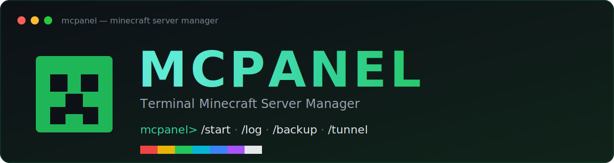

<p align="center">
  
</p>

<p align="center">
  <a href="https://www.npmjs.com/package/@woopsy/mcpanel"></a>
  =22">
  
  
</p>

# MCPANEL

A terminal-based **single-server** Minecraft server manager with an Arch/neofetch-style
startup screen. Connect one server folder and control it with simple slash commands —
start/stop, live logs in a separate window, backups, plugins, `server.properties` editing,
Java switching, and one-click [Playit.gg](https://playit.gg) tunnels so friends can join.

```
  __  __  ____ ____   _    _   _ _____ _
 |  \/  |/ ___|  _ \ / \  | \ | | ____| |
 | |\/| | |   | |_) / _ \ |  \| |  _| | |
 | |  | | |___|  __/ ___ \| |\  | |___| |___
 |_|  |_|\____|_| /_/   \_\_| \_|_____|_____|
  Minecraft Server Manager
──────────────────────────────────────────────────
  path:     /home/you/servers/SMP
  type:     Fabric 26.1.2
  ram:      4G
  status:   Running
  java:     25.0.3
  os:       WSL
  tunnel:   Online
──────────────────────────────────────────────────
mcpanel>
```

---

## Requirements

- **Node.js 22+** — <https://nodejs.org>
- **Java** matching your Minecraft version (e.g. MC 26.x needs **Java 25**, MC 1.20–1.21 needs **Java 21**).
  MCPANEL can list and switch between installed JVMs with `/java`.

---

## Install

MCPANEL installs as a global npm command. **However you install it, you run it the same way: type `mcpanel`.**

### 🐧 WSL / Linux / macOS (bash/zsh)

```bash
npm install -g @woopsy/mcpanel
mcpanel
```

If you get `mcpanel: command not found`, your npm global `bin` isn't on `PATH`. Add it:

```bash
echo 'export PATH="$(npm config get prefix)/bin:$PATH"' >> ~/.bashrc
source ~/.bashrc
```

### 🪟 Windows — Command Prompt (cmd)

```bat
npm install -g @woopsy/mcpanel
mcpanel
```

### 🪟 Windows — PowerShell

```powershell
npm install -g "@woopsy/mcpanel"
mcpanel
```

> In PowerShell, quote the scoped name (`"@woopsy/mcpanel"`) so the `@` isn't parsed as a splat operator.

### Run without installing (npx)

```bash
npx @woopsy/mcpanel
```

---

## First run

1. Launch `mcpanel`.
2. It shows the banner, then asks for your **server folder path** (a folder containing
   `server.jar` and/or `server.properties`). Paste it and press Enter.
   - On WSL you can paste a **Windows path** like `C:\Users\you\Server` — MCPANEL converts
     it to `/mnt/c/...` automatically.
3. MCPANEL detects the server type + Minecraft version, saves it, and drops you at the prompt.

To connect a different server later: `/sync <path>`.

---

## Commands

| Command | What it does |
|---|---|
| `/start` · `/stop` · `/restart` | Control the server process |
| `/console` | Interactive console (type commands sent to the server) |
| `/log` | Open **live logs in a new terminal window** (`tail -f`) |
| `/info` | Server path, type, version and status |
| `/sync <path>` | Connect a different server folder |
| `/properties` | Edit `server.properties` interactively |
| `/java [path]` | Show/list installed JVMs, or set the one used to launch |
| `/stats` | System + server CPU / RAM / disk usage |
| `/folder` | Open the server folder in your file explorer |
| `/backup create` · `list` · `restore <id>` | Manage ZIP backups |
| `/plugins list` · `install <url>` · `remove <name>` | Manage plugins |
| `/tunnel java` · `bedrock` · `status` · `stop` · `reset` | Playit.gg tunnels |
| `/config` · `/clear` · `/help` · `/exit` | Utilities |

Type `/help` inside MCPANEL for the full menu, and use **Tab** for autocompletion.

---

## Notes

- **Single server by design.** MCPANEL manages exactly one server (the one you sync).
- **Playit tunnel.** The first `/tunnel` claims a free Playit agent in your browser once;
  the binary is downloaded automatically. Your secret is stored locally in `config.json`
  (which is git-ignored — don't commit it).
- **`/log` in a new window.** On WSL it opens via the Windows console; on Linux it uses your
  terminal emulator; on macOS it uses Terminal. If none is available it falls back to an
  in-place read-only view (`/back` to exit).

---

## Development

```bash
git clone https://github.com/Woopsyyy/MCPANEL.git
cd MCPANEL
npm install
npm run dev      # run from TypeScript (ts-node)
npm run build    # compile to dist/
```

### Releasing (maintainers)

Publishing is automated by GitHub Actions (`.github/workflows/publish.yml`). You never
run `npm publish` by hand.

**One-time setup:**
1. Create an npm **Automation** token: npmjs.com → Access Tokens → Generate New Token →
   *Automation* (these bypass 2FA in CI).
2. Add it to the repo: GitHub → Settings → Secrets and variables → Actions → New repository
   secret → name `NPM_TOKEN`.

**Every release after that:**
```bash
npm version patch      # or minor / major — bumps package.json and creates a git tag
git push --follow-tags # pushes the commit + tag; CI builds and publishes to npm
```

The workflow skips automatically if that version is already on npm, and `npm install -g @woopsy/mcpanel@latest`
picks up the new version once it's green.

---

## License

[MIT](LICENSE) © [Woopsy](https://github.com/Woopsyyy)
